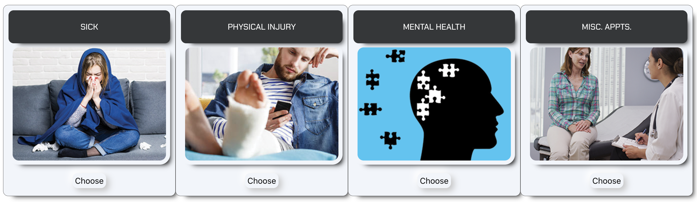
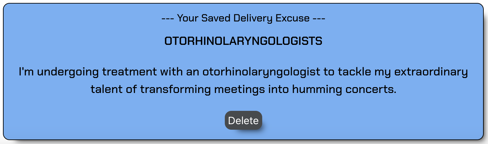

# Workaholics: Callinski

## Description:
* Let's say you need a day off of work but have no idea what to say.  We have you covered. You'll go to CallinSki, decide why you want to call in.

## User Story:
* I want to notify my boss that I am unable to go to work today. I don't know exactly what to say and it makes me nervous.
* Sick Excuses for feeling unwell and unable to perform my duties.
* Physical Injury Excuses after sustaining a physical injury that prevents me from attending work.
* Mental Health Excuses coping with mental health challenges that make it difficult for me to go to work.
* Misc. Appointments Excuses for a scheduled Doctor's appointment during work hours.

## Installation:
* On a web browser please follow the link to begin exploring. [Workaholics: Callinski.](https://junel-balbin.github.io/Workaholics)
* Accessible on any mobile device and tablet.

## Usage:
* After landing on the webpage and clicking on "Let the excuses begin!". You should see 4 cards displaying the different categories of excuse available (Sick, Physical Injury, Mental Health and Misc. Appointments).

* To help you remember what day, date and time when you are contacting your boss we provided the current Day, Date and Time.

* Upon selecting an excuse card. You should be able to generate a plausible random excuse related to the chosen category and save the excuse you would like to use to call or message your boss.

* After you have selected & saved your excuse. You have the option to search a GIF from GIPHY related to the excuse to lighten the mood because laughter is the best medicine.

* Additionally, you have the ability to search and choose from a variety of Chicken Soup Recipes. Treat yourself to a comforting hot meal while you are away.  Click the Ninja Star to favorite & save.

* There is also a feature to search for and display the nutrition facts of any food item you desire. Allowing you to gather information on the nutritional value of specific foods to get you on your way to recovery. Click Thumbs Up to like & save or Thumbs Down to dislike & save.

* Finally we have a clickable link to access the WebMD Symptoms Checker for any minor health-related questions or concerns you may have and ensuring that you can address any legitimate medical issues.  Current available API's for symptom checkers are unreliable and unsafe for minor medical diagnosis, so we decided against it.  In the end, WebMD was more appropriate.

## Application User Interface:

## Future Development:
* The future development of the application aims to be a comprehensive tool for homebound individuals. Addressing various aspects of being sick at home. It will offer entertainment choices like movies, tv shows and video games searches. Provide health support with over the counter medicine feature for minor health issues. Help provide temporary relief based on common ailments and can help you find appropriate remedies. Assists with workplace communication when calling in sick. By combining these features with the current application will no doubt help make sick days more manageable and comfortable. Let's not get other people sick.

## Team Member Role:
* Rolfe Eric Ordona: Project Lead, Idea Conceptualizer & Code Kickstarter.
* Tammy Bradley: Quality Assurance, Idea Conceptualizer & Intermediary.
* Alexa Webb: Quality Assurance & Troubleshooting Assistant.
* Junel Balbin: API Research, CSS styling & Github Admin.

## Resources:
* Bard & ChatGpt for troubleshooting.
* Stack Overflow, MDN & w3schools.
* Google search & Youtube videos.
* EdX and UCB.

## Coded With:
* HTML, CSS & JavaScript.
* Visual Studio Code.
* [Bulma CSS Framework.](https://bulma.io/)
* [Vanilla Data Tilt.](https://micku7zu.github.io/vanilla-tilt.js/)
* [Giphy Gifs API.](https://developers.giphy.com/)
* [API-Ninjas API.](https://api-ninjas.com/)
* [Font Awesome.](https://fontawesome.com/)
* [Google Fonts.](https://fonts.google.com/)
* [Adobe XD.](https://helpx.adobe.com/xd/get-started.html)
* [jQuery.](https://jquery.com/)
* [Day.js](https://day.js.org/)

## Contributing:
* Any ideas or feedback is very much appreciated.

## Project Links:
* [Workaholics: Callinski.](https://junel-balbin.github.io/Workaholics/)
* [Github Repository.](https://github.com/Junel-Balbin/Workaholics)
* [Presentation.](https://docs.google.com/presentation/d/e/2PACX-1vS0x619lqr0uBfPpfE7ZP5TYgvJT5_IMmmSUplUCQobIlZ_ijeHYlwDfJIUsJaK_uzvupgI6q1Ei71w/pub?start=false&loop=false&delayms=3000)

## License: 
* MIT License